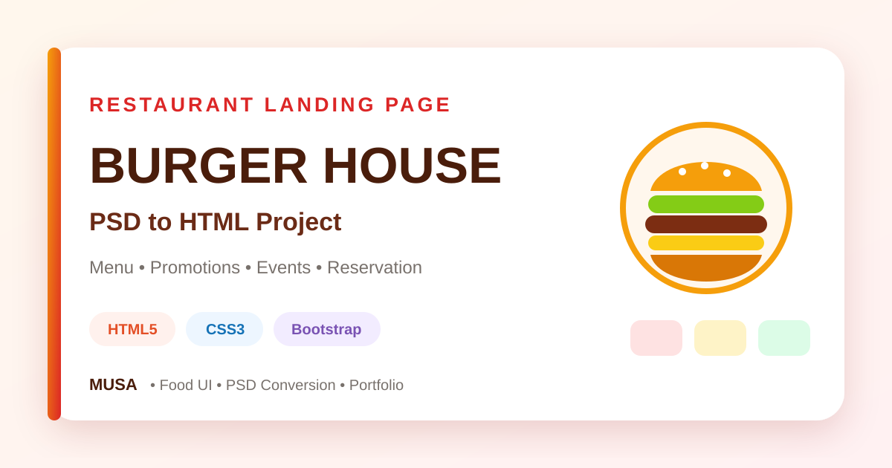
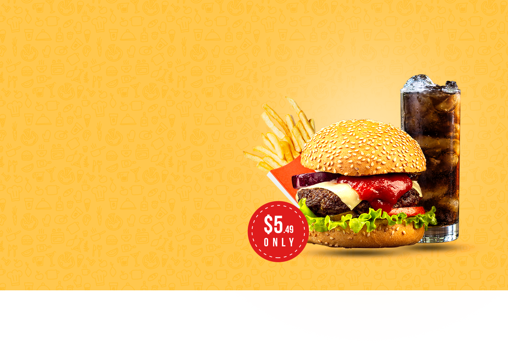
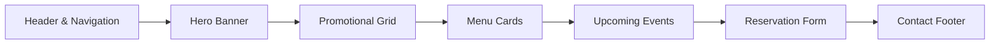

<div align="center">



<br>

# 🍔 Burger House

### PSD-to-HTML Restaurant Landing Page

A visually rich, desktop-focused front-end assignment recreated from a restaurant PSD using clean HTML, custom CSS, Bootstrap utilities, Google Fonts, and Font Awesome.

<br>

[](https://github.com/samusa099/Assignments_10.2)
[](https://github.com/samusa099)
[](https://github.com/samusa099/Assignments_10.2)

[](https://developer.mozilla.org/docs/Web/HTML)
[](https://developer.mozilla.org/docs/Web/CSS)
[](https://getbootstrap.com/)
[](https://fontawesome.com/)

[](https://github.com/samusa099/Assignments_10.2)
[](https://github.com/samusa099/Assignments_10.2)
[](https://github.com/samusa099/Assignments_10.2/commits/main)
[](https://github.com/samusa099/Assignments_10.2/stargazers)
[](https://github.com/samusa099/Assignments_10.2/forks)

<br>

[**Project Overview**](#-project-overview) · [**Preview**](#-project-preview) · [**Features**](#-feature-showcase) · [**Run Locally**](#-run-locally) · [**Usage Guide**](HOW_TO_USE.md)

</div>

---

## 📌 Project Overview

**Burger House** converts a restaurant promotional design into a structured static website. It combines bold typography, food photography, layered promotional sections, menu cards, event content, reservation inputs, and a branded footer in one cohesive front-end experience.

> This repository focuses on visual implementation and front-end layout practice. Ordering, reservation submission, authentication, cart, and payment functions are not connected to backend services.

<table>
<tr>
<td width="25%" align="center"><strong>🎯 Purpose</strong><br>PSD conversion practice</td>
<td width="25%" align="center"><strong>🖥️ Layout</strong><br>Desktop-focused landing page</td>
<td width="25%" align="center"><strong>🧱 Architecture</strong><br>Static HTML and CSS</td>
<td width="25%" align="center"><strong>✅ Status</strong><br>Assignment completed</td>
</tr>
</table>

---

## 🖼️ Project Preview

<div align="center">

### Hero Experience



<br><br>

### Promotional Content

<table>
<tr>
<td width="50%" align="center">
<br>
<strong>Most Popular Burger</strong>
</td>
<td width="50%" align="center">
<br>
<strong>Promotional Campaign Card</strong>
</td>
</tr>
</table>

</div>

---

## ✨ Feature Showcase

| Section | Implementation | User Experience |
|---|---|---|
| **Hero Banner** | Full-width background, logo, navigation, delivery contact, and display typography | Immediately establishes the restaurant identity |
| **Promotion Grid** | Large and stacked image cards with overlay text | Highlights offers through strong visual hierarchy |
| **Menu Cards** | Three-column Bootstrap layout with product imagery and CTA buttons | Presents featured burger selections clearly |
| **Event Section** | Split content-and-image presentation | Adds storytelling and campaign depth |
| **Reservation Form** | Name, email, date, time, and guest inputs | Demonstrates a practical restaurant interaction flow |
| **Footer** | Brand summary, address, email, and social icons | Completes the page with contact information |

---

## 🎨 Visual Design System

<table>
<tr>
<td width="33%" valign="top">

### Typography

- **Alfa Slab One** — display headings
- **Bebas Neue** — promotional labels
- **Montserrat** — navigation and body copy

</td>
<td width="33%" valign="top">

### Colour Direction

- Warm burger brown
- Golden yellow
- Promotional red
- Soft neutral backgrounds
- White content surfaces

</td>
<td width="33%" valign="top">

### UI Approach

- Image-led storytelling
- Strong uppercase headings
- Layered promotional cards
- Clear call-to-action buttons
- Section-based page rhythm

</td>
</tr>
</table>

---

## 🛠️ Technology Stack

| Technology | Role in the Project |
|---|---|
| **HTML5** | Page structure, navigation, content sections, cards, forms, and footer |
| **CSS3** | Layout, spacing, colour, typography, image positioning, and interaction styling |
| **Bootstrap 5** | Container, grid, column, and spacing utilities |
| **Google Fonts** | Restaurant-style display and supporting typography |
| **Font Awesome 4** | Social-media icon presentation |

---

## 🧭 Page Architecture



---

## 🗂️ Repository Structure

```text
Assignments_10.2/
├── assets/
│   └── repository-cover.svg   # README cover artwork
├── css/
│   └── style.css              # Main custom stylesheet
├── images/                    # Logo, banners, burgers, and UI images
├── index.html                 # Website entry point
├── HOW_TO_USE.md              # Detailed customisation and usage guide
└── README.md                  # Project overview and documentation
```

---

## 🚀 Run Locally

### 1. Clone the repository

```bash
git clone https://github.com/samusa099/Assignments_10.2.git
```

### 2. Enter the project folder

```bash
cd Assignments_10.2
```

### 3. Launch the website

Open `index.html` directly in a modern browser, or use the **Live Server** extension in Visual Studio Code for automatic refresh while editing.

<div align="center">

[](https://github.com/samusa099/Assignments_10.2)
[](https://github.com/samusa099/Assignments_10.2/archive/refs/heads/main.zip)
[](HOW_TO_USE.md)

</div>

---

## 📚 What This Project Demonstrates

- Translating a visual design into working HTML and CSS
- Organising a long landing page into identifiable content sections
- Combining Bootstrap utilities with custom styling
- Positioning text over promotional images
- Applying external font families and icon libraries
- Building product cards and reservation form interfaces
- Managing reusable project assets through a clear repository structure

---

## 🔧 Recommended Improvements

The current assignment can be extended by adding:

- Responsive breakpoints for tablet and mobile devices
- Functional navigation links and form validation
- JavaScript-based menu filtering or slider behaviour
- Accessible labels, alt-text review, and keyboard states
- A backend reservation service
- Deployment through GitHub Pages, Netlify, or Vercel

---

## 📖 Documentation

| Resource | Best Used For |
|---|---|
| [**HOW_TO_USE.md**](HOW_TO_USE.md) | Understanding how, why, and where to customise, reuse, extend, and publish the project |
| [**index.html**](index.html) | Reviewing the complete page structure |
| [**style.css**](css/style.css) | Studying the project's layout and visual styling |
| [**images/**](images/) | Accessing the original design assets |

---

## 👤 Author

<div align="center">

### **Musa**

**Internationally certified HR professional and data analytics practitioner from Bangladesh.**

Musa combines people operations, Excel, Power BI, SQL, and technology-driven problem-solving to create practical, structured, and user-focused projects.

[](https://github.com/samusa099)
[](https://github.com/samusa099/Assignments_10.2)

<br>

<sub>Designed from a PSD concept and developed for front-end learning and portfolio presentation.</sub>

</div>
